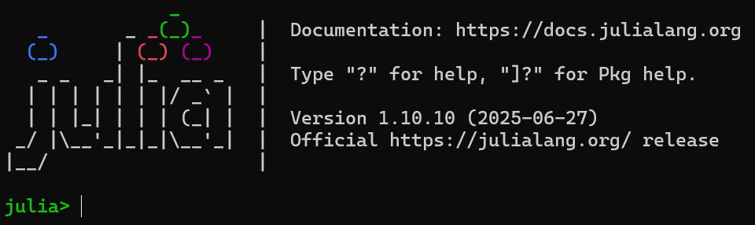

# Introduction
This is a module designed for the NSERC CREATE grant _Training for novel directions in quantitative climate science_. 

The ocean is awash with important fluid dynamical processes at all spatial and temporal scales. 

In this module we will create a simulation of flow around a submesoscale ocean front using Oceananigans, a Julia package for finite-difference simulations of the Boussinesq equations, intended for an oceanic context.

The module will assume basic familiarity with fluid dynamics fundamentals and the incompressible Navier-Stokes equations. Proficiency in Julia is not required and should be intuitive for those with experience in Python (numpy) or MATLAB. An outline of this module is as follows:

- Julia setup for Oceananigans and GLMakie (plotting software)
- Derivation of the Boussinesq equations and subsequently the Sawyer-Eliassen equations for the flow in the frontal plane
- Instabilities in the Sawyer-Eliassen equations
- Setting up a simulation
- Visualization
- Analysis and post-processing

# Setup
For those familiar with Julia, this module will use the latest version of Julia 1.10 (1.10.10 as of writing) and the `Project.toml` file will consist of the packages
```
  [5a033b19] CurveFit v0.6.1
  [e9467ef8] GLMakie v0.12.0
  [9e8cae18] Oceananigans v0.100.6
```

Those new to Julia can follow the instructions below.
## Installing Julia
Installation instructions are available at https://julialang.org/install/. The recommended method is to install `juliaup` which is a command-line utility. Then you should be able to run it from the terminal
```bash
juliaup
```
We would like to use Julia 1.10, just do `juliaup add 1.10` to download the latest version. Once this is done, type `julia` to enter the REPL:

Documentation is available at https://docs.julialang.org/en/v1/manual/getting-started/. This module will not require advanced knowledge of Julia. Make sure you are comfortable with
- Creating `Tuple`s and `NamedTuple`s with `(a, b)` and `(; a, b=42)`, for instance
- Defining functions with a `function` block and assignment form `f(x) = x^2`
- Control flow with `if`
- `for` loops
- Operations on arrays, broadcasting
- Specifically for simulations: ensuring hygenic variable scope (avoiding global variables)

Play around! Julia is simple to learn if coming from other common scientific languages. They even provide a helpful reference for important differences to others: https://docs.julialang.org/en/v1/manual/noteworthy-differences/

It is useful to make scripts, conventionally a `.jl` file extension. These can be run from the terminal with
```bash
julia -t 4 path/to/script.jl
```
Note the optional `-t` argument. This is the number of threads that Julia should use. It defaults to one, but simulations will greatly benefit from multithreading, so I suggest using as many as your computer has available (use 4 if you are unsure) when running simulation code.
## Adding Oceananigans and GLMakie
