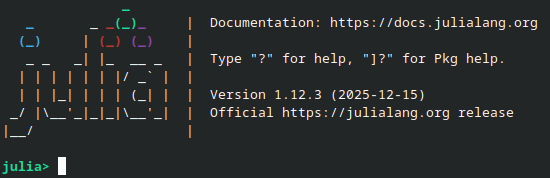
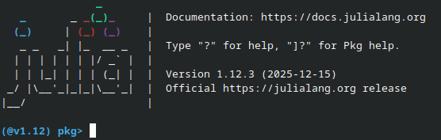
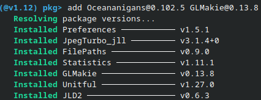
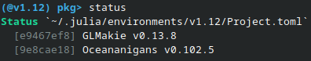

# Introduction
This is a module designed for the NSERC CREATE grant _Training for novel directions in quantitative climate science_. 

The ocean is awash with important fluid dynamical processes at all spatial and temporal scales. Here, we are interested in the *submesoscale*: ocean flows with a length scale of roughly $`100\,\text{m} - 10 \,\text{km}`$. In submesoscale-resolving photos of the ocean surface, it is common to see strongly anisotropic features called *fronts*. These features are associated with significant vertical velocities that transport heat, nutrients and carbon between the interior of the ocean and the air-sea interface. The associated strong vertical and horizontal gradients may also be subject to various instabilities. The impact of flows at these scale on the global ocean and climate is an active frontier of research.

> 
> A submesoscale-resolving image of the ocean surface. The bright green colour is due to a high concentration of phytosynthesising cyanobacteria, which traces motion of the surface currents. Many small-scale features are visible, with much of the flow being organised into long-thin frontal and filamentary features.
>
> Photo credit: [Cyanobacteria in the Baltic Sea, NASA Landsat 8 OLI, August 2018](https://oceandata.sci.gsfc.nasa.gov/gallery/586/)

In this module we will create a simulation of flow around a submesoscale ocean front using Oceananigans, a Julia package for finite-difference simulations of the Boussinesq equations, intended for an oceanic context. The setup is motivated by the theory of symmetric instability, an instability in rotating, baroclinic fluids that is important in the submesoscale ocean.

The module will assume basic familiarity with fluid dynamics fundamentals and the incompressible Navier-Stokes equations. Proficiency in Julia is not required, the language should be intuitive for those with experience in Python (NumPy) or MATLAB. An outline of this module is as follows:

0. Julia setup for Oceananigans and GLMakie
1. Derivation of the Boussinesq equations and subsequently the Sawyer-Eliassen equations for the flow in the frontal plane
2. Instabilities in the Sawyer-Eliassen equations
3. Setting up a simulation
4. Visualization - plotting the results
5. Analysis and post-processing of simulation output

# Setup
For those familiar with Julia, this module will use the latest version of Julia 1.12 (1.12.3 as of writing) and the `Project.toml` file will consist of the packages
```
  GLMakie v0.13.8
  Oceananigans v0.102.5
```
To keep setup as simple as possible, this module does not use computational notebooks or assume you have an IDE set up for Julia.  Those new to Julia can follow the instructions below to install and configure it.

## Installing Julia
Installation instructions are available at https://julialang.org/install/. The recommended method is to install `juliaup` which is a command-line utility. Then you should be able to run it from the terminal
```bash
juliaup
```
We would like to use Julia 1.12, just do `juliaup add 1.12` to download the latest version. Once this is done, type `julia` to enter the REPL:

> 
>
> A screenshot of the Julia 1.12.3 REPL.

Documentation is available at https://docs.julialang.org/en/v1/manual/getting-started/. This module will not require advanced knowledge of Julia. Make sure you are comfortable with

- [Assigning and using variables](https://docs.julialang.org/en/v1/manual/variables/)
- [Creating `Tuple`s and `NamedTuple`s with `(a, b)` and `(; a, b = 42)`, for instance](https://docs.julialang.org/en/v1/manual/functions/#Tuples)
- [Defining functions with a `function` block and assignment form `f(x) = x^2`](https://docs.julialang.org/en/v1/manual/functions/)
- [Control flow with `if`](https://docs.julialang.org/en/v1/manual/control-flow/#man-conditional-evaluation)
- [`for` loops](https://docs.julialang.org/en/v1/base/base/#for)
- [Operations on arrays, broadcasting](https://docs.julialang.org/en/v1/manual/arrays/)
- [Specifically for simulations: ensuring hygenic variable scope (using constant global variables or passing parameters)](https://clima.github.io/OceananigansDocumentation/v0.102.5/simulation_tips#Avoid-global-variables-whenever-possible)

Play around! Julia is simple to learn if coming from other common scientific languages. They even provide a helpful reference for important differences to others: https://docs.julialang.org/en/v1/manual/noteworthy-differences/

It is useful to make scripts, conventionally a `.jl` file extension. These can be run from the terminal with
```bash
julia -t 4 path/to/script.jl
```
Note the optional `-t` argument. This is the number of threads that Julia should use. It defaults to one, but simulations will greatly benefit from multithreading (up to a point), so I suggest using 2-4 when running simulation code.

## Adding Oceananigans and GLMakie
Julia comes with its own package manager, all you have to do it run Julia to access the REPL then type `]`:

> 
> 
> A screenshot of the Julia REPL after typing `]` to enter the package manager.

Now we can install the required packages:
- `Oceananigans` is the Boussinesq equation simulator we are using
- `GLMakie` is for producing plots

To install the versions used in this module, use `@`. If you would like to use the latest compatible versions, simply remove the version specification `@a.b.c`, though beware there may be differences in some syntax.

```
add Oceananigans@0.102.5 GLMakie@0.13.8
```

Then they will be installed, starting with dependencies:

> 
>
> Installing the packages Oceananigans (version 0.102.5) and GLMakie (version 0.13.8).

This will take a while. Packages you explicitly install like above become part of your `Project.toml` and can be viewed with `status` and accessed in scripts with `using`. All of their dependencies are part of your `Manifest.toml` and these can be viewed with `status -m`. The `status` of my environment looks like

> 
>
> Status of the environment after installing the above packages
