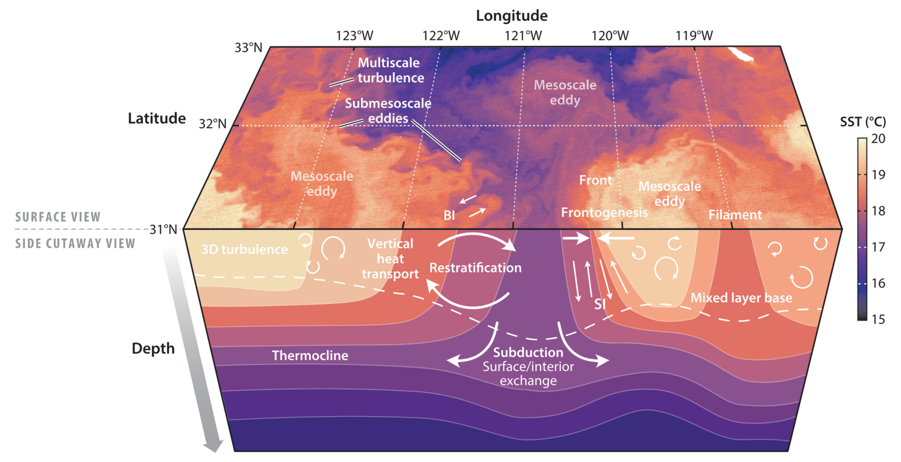

# The equations of motion 
This section will outline the derivation of the Boussinesq equations in a rotating frame from the equations of motion of an inviscid fluid,
```math
\frac{\text{D}\vec u}{\text{D}t} = -\frac{1}{\rho}\nabla p - g\hat z,\quad \frac{\text{D}\rho}{\text{D}t} + \rho \nabla \cdot \vec u = 0  \quad \text{and}\quad \frac{\text{D}\rho}{\text{D}t} - \frac{1}{c_s^2}\frac{\text{D} p}{\text{D}t} = \frac{\dot Q}{c_p}\frac{\partial \rho}{\partial T}_{\text{const } p}, \qquad (1.1)
```
where $\vec{u}$ is the velocity, ${\rho}$ is the density, $p$ is pressure and $g$ is the gravitational acceleration. The Lagrangian derivative ${\text{D} / \text{D}t = \partial t / \partial t + \vec u \cdot \nabla}$ is the rate of change of a property of a fluid parcel and the coordinate system is such that $+z$ is aligned with the vertical (away from the  centre of the Earth).  

The form of the thermodynamic equation presented here includes the temperature $T$, heating rate per unit mass $\dot Q$, the specific heat capacity at constant pressure $c_p$ and the speed of sound $c_s$. In addition, we need an equation of state that relates density to other variables. For a liquid, exact equations of state are typically unknown so we use the linearised form, 
```math
\rho(T, p) = \rho_0\left [1-\alpha(T - T_0) + \frac{p-p_0}{\rho_0c_s^2}\right ],
```
where $\alpha$ is the coefficient of thermal expansion and $\rho_0$, $T_0$, $p_0$ are reference density, temperature and pressure respectively. This ignores the contribution of salinity (water with more dissolved salt is denser), but this is a simple addition. 

We will also briefly introduce the role of density fronts in the ocean, and how idealized studies of fronts, such as the one we will simulate later, may be constructed. 

This section is intended for recap and as a theoretical context for the main, simulation component of the module. Those familiar with the Boussinesq equations for ocean flow may skip it, and those who just want to start doing some simulations may skim this and the following section. A detailed derivation of the Boussinesq equations from the basic equations of motion of a fluid can be found in $\S 2.4$ of [Vallis, 2017, *Atmospheric and Oceanic Fluid Dynamics*](https://doi.org/10.1017/9781107588417)

## Fluid in a rotating frame
Observers at a fixed point relative to the surface of the Earth rotate with it. This is not an inertial frame, and Newton's second law doesn't apply in its unmodified form. Those familiar with solid body mechanics will recall that, for an inertial frame $(I)$ and frame $(R)$ rotating at a constant angular velocity ${\vec{\Omega} = \Omega \hat{n}}$ the rate of change of a vector $`{\vec A}`$ in the two frames are related by
```math
\left.\frac{\text d \vec A}{\text{d}t}\right|_{(I)} = \left.\frac{\text d \vec{A}}{\text{d}t}\right|_{(R)} + \vec \Omega \times \vec{A}.
```
Applying this operator twice to the position of a fluid parcel ${\vec{x}}$, we can form Newton's second law
```math
\left.\frac{\text{d}^2\vec x}{\text{d}t^2}\right|_{(I)} = \left (\left.\frac{\text{d}}{\text{d}t}\right|_{(R)} + \vec \Omega \times\right )\left (\left.\frac{\text{d}}{\text{d}t}\right|_{(R)} + \vec \Omega \times \right)\vec x = \vec F,
```
where $\vec u = \text d\vec x/\text d t|_{(R)}$ is the velocity parcel measured in the rotating frame of reference and $\vec F$ represents external forces. The right-hand side above gives two inertial (pseudo-)forces
```math
\left.\frac{\text{d}\vec x}{\text{d}t^2}\right|_{(I)} = \left.\frac{\text{d}\vec u}{\text{d}t}\right|_{(R)} + 2\vec{\Omega} \times \vec u - \Omega^2(\vec x - \vec x \cdot \hat n \,\hat n).
```
The term proportional to $\Omega^2$ is the centrifugal acceleration, which is well known. It is directed perpendicularly away from the rotational axis and can be absorbed into the gravitational potential with little fuss. The term $2\vec{\Omega} \times \vec u$ is the Coriolis acceleration and arises due to differences in relative velocity between a parcel and its surroundings as it moves towards or away from the axis of rotation. At all but the largest scales, the spherical geometry of the Earth can be ignored and we can work in a coordinate system with ${\hat{z}}$ aligned with the local vertical direction, $\hat x$ pointed directly east and ${\hat{y}}$ pointed directly north.

In this coordinate system, the Coriolis acceleration can be written
```math
2\vec{\Omega} \times \vec u = 2\Omega \begin{pmatrix}0 \\ \cos \lambda \\ \sin \lambda \end{pmatrix} \times \begin{pmatrix}u \\ v \\ w \end{pmatrix} = 2\Omega \begin{pmatrix} -v\,\sin \lambda  + w\,\cos \lambda \\ u\,\sin \lambda \\ -u\,\cos \lambda \end{pmatrix},
```
where $\lambda$ is the latitude.

In most geophysical applications, gravity is strong compared to rotation (${|2\Omega u \cos \lambda| \ll g}$) and vertical velocities are small (${w\cos \lambda \ll v\sin\lambda}$ away from the equator where $\sin\lambda \approx 0$). We can then apply the so-called _traditional approximation_:
```math
2\vec{\Omega} \times \vec u \approx 2\Omega \begin{pmatrix} -v\sin \lambda   \\ u\sin \lambda \\ 0 \end{pmatrix} = f \hat z \times \vec u\quad \text{where} \quad f = 2\Omega \sin\lambda
```
is the Coriolis parameter, or Coriolis frequency. As a reference, $`f \approx 10^{-4}\,\text{s}^{-1}`$ at mid-latitudes $`(\lambda \approx 45^{\circ}\,\text{N})`$. Note that under this approximation, the equations of motion are now invariant under rotations around the $`\hat{z}`$ axis.

Turning back to Newton's second law, the acceleration in the rotating reference frame, namely, $`\text{d}\vec{u}/\text{d}t|_{(R)}`$, becomes the Lagrangian acceleration of a fluid parcel measured on a rotating Earth, namely, $\text D\vec u/\text D t$. Newton's second law then becomes
```math
\frac{\text{D}\vec u}{\text{D}t} + f \hat z \times \vec u= -\frac{1}{\rho}\nabla p - g\hat z.
```

When is rotation important? 
First off, we need to introduce the limiting case when rotation is the _only_ pheomenon that controls the current, in which case it is said to be in _geostrophic balance_. Then, the horizontal pressure force entirely balances the Coriolis acceleration:
```math
f \hat z \times \vec u= -\frac{1}{\rho}\nabla_H p,
```
where $\nabla_H$ is the horizontal gradient operator.

More generally, if we assume that the timescale of a flow is advective ${T \sim L/U}$ for velocity scale $U$ and horizontal length scale $L$, then the relative size of the first two terms is
```math
\frac{{\text{D}\vec u}/{\text{D}t}}{f \hat z \times \vec u} \sim \frac{U^2/L}{fU} = \frac{U}{fL}.
```
This is the Rossby number $`{\text{Ro} = U / fL}`$. The effect of rotation is greater when ${\text{Ro}}$ is small, with geostrophic balance becoming increasingly dominant as ${\text{Ro}}\to 0$. For ocean flow, which is typically $`{U \sim 0.1\! -\! 1\,\text{m}\,\text{s}^{-1}}`$ and at mid-latitudes, rotation dominates the momentum equation for flow structures with 
```math
\text{Ro} \ll 1 \implies L \gg \frac{1\,\text{m}\,\text{s}^{-1}}{10^{-4}\,\text{s}^{-1}} = 10 \,\text{km}.
```
So, away from the equator where ${f \approx 0}$, rotation is the most important component of the acceration of a fluid parcel at many scales of interest for oceanography. Flow in this rotation-dominated regime can still slowly evolve due to weak (i.e., $`{O(\text{Ro})}`$) _ageostrophic_ velocities, and is called _quasi-geostrophic_. (Quasi-)Geostrophy can be a strong constraint on the possible motion of a fluid, and much understanding has been gleaned by studying the behaviour of models built on approximations to the equations of motion valid for $`{\text{Ro}\ll 1}`$.


## The Boussinesq approximation
Water is mostly incompressible under the conditions of ocean flows we are considering here, so the density of sea water depends primarily on its temperature and salt content, with an average of about $`\rho_0 = 1027\,\text{kg}\,\text{m}^{-3}`$. Especially near the surface of the ocean, density changes are small, with an upper range of about $`{\delta \rho \sim 10 \,\text{kg}\,\text{m}^{-3}}`$. We may therefore seek an approximation of equations ${(1.1)}$ that is appropriate in this case. 

We decompose the density and pressure into hydrostatic and perturbation terms
```math
p(x, y, z, t) = \rho_0 gz + \delta p(x, y, z, t) \quad \rho = \rho_0 + \delta \rho(x, y, z, t)
```
the momentum equation becomes
```math
(\rho_0 + \delta \rho)\frac{\text{D}\vec u}{\text{D}t} = -\nabla \delta p - \delta \rho g\hat z
```
If $\delta\rho \ll \rho_0$, we can neglect the corresponding term on the LHS
```math
\rho_0 \frac{\text{D}\vec u}{\text{D}t} \approx -\nabla \delta p- \delta \rho g\hat z.
```
Note that we cannot neglect the term $\delta \rho g$. The rate of change of velocity due to gravitational acceleration $`g/U\approx 10\!-\!100\,\text{s}^{-1}`$ is very large compared to typical flows in the ocean, which may evolve over hours, days or much longer, so the product $\delta \rho g$ is not small compared to $`\rho_0D\vec{u} /Dt`$. We usually define a geopotential $\phi = \delta p/\rho_0$ and buoyancy $b = -\delta\rho g /\rho_0$ to get the Boussinesq momentum equation.
```math
\frac{\text{D}\vec u}{\text{D}t} = -\nabla \phi + b\hat z.
```
The mass conservation equation may be written
```math
\frac{\text{D}\delta \rho}{\text{D}t} + (\rho_0 +  \delta \rho)\nabla \cdot \vec u = 0\implies \nabla \cdot \vec{u} \approx 0
```
An equation for $b$ is required, which is derived from the thermodynamic equation for seawater. Using the equation of state:
```math
\frac{\text{D}b}{\text{D}t} = \dot b = \frac{g\alpha}{c_p}\dot Q 
```
For the rest of this module, we will assume that there are no non-conservative sources of heat and buoyancy is therefore conserved:
```math
\frac{\text{D}b}{\text{D}t} = 0.
```

## The Boussinesq equations

Combining traditional rotation and the Boussinesq approximation, we arrive at the inviscid Boussinesq equations for ocean flow in the absence of sources of momentum and buoyancy
```math
\frac{\text{D}\vec u}{\text{D}t} + f \hat z \times \vec u = -\nabla \phi + b\hat z,\quad \frac{\text{D}b}{\text{D}t} = 0 \quad \text{and}\quad \nabla \cdot \vec u = 0.
```
These model the flow of an almost-constant density, incompressible fluid. Note that the term $\phi$ is found by enforcing the incompressibility constraint. This set of equations describes a great deal of ocean phenomena, and may be applicable to thin horizontal slices of the atmosphere also.

> ### Exercise 1.1
>
> Show that, for a fluid with ${\frac{\text{D}\vec{u}}{\text{D}t} = 0}$, the thermal wind relations are satisfied
> ```math
> f\frac{\partial u}{\partial z} = -\frac{\partial b}{\partial y}, \quad f\frac{\partial v}{\partial z} = \frac{\partial b}{\partial x} % \quad \text{or}\quad f\hat z\times \frac{\partial \vec u_H}{\partial z} = \nabla_H b
> ```
> The component of the flow that satisfies this relationship is called the _balanced_ flow. At large, geostrophic scales, most of the flow is balanced and this relationship can be used to infer information about the flow from knowledge of its density/buoyancy gradients.

# Ocean fronts

Density fronts are highly anisotropic structures consisting of a horizontal change in density in one *across-front* direction and only gradual changes in an *along-front* direction. In the open ocean, they are primarily created at the edges of large-scale vortices, or seperating boundary currents like the Gulf Stream or Kuroshio current. They can also be created at coasts, such as by inflow of fresh, light water from rivers.

> 
>
> Sea surface temperature from NASA MODIS, November 2020. A cutaway view shows a hypothetical vertical structure of temperature. Figure from [Taylor and Thompson 2013]()

An important feature of fronts, especially at smaller scales $`(\text{Ro} \sim 1)`$, is the secondary circulation that forms due to the effect of the background flow or forcing by winds or cooling at the ocean surface. This circulation transports fluid around the front and is responsible for an intense vertical transport of heat, carbon and nutrients. 

Strong fronts may also be susceptible to instabilities. In this module we will explore the evolution of such a front and the consequences of instability for the vertical transport of fluid properties.

## Describing an ideal front
We use a linearised state to define an ideal front with constant horizontal and vertical buoyancy gradients, as well as a balanced thermal wind jet whose orientation we choose to be along $\hat y$ without loss of generality, namely,
```math
b_0 = N^2z + M^2 x \quad \text{and} \quad v_0  = \zeta x +Sz= \zeta x + \frac{M^2}{f} z,
```
where we assume that $v_0 = \zeta x$ on $z=0$.

> ### Exercise 1.2
>
> Verify that the fields above are indeed in thermal wind balance.

## Flow around an ideal front
The total flow is the sum of the frontal flow itself ($v_0\hat y, b_0$) and any perturbations (note the change in notation for $\vec u, b$), namely,
```math
\vec u_\text{tot} = v_0\hat y + \vec u,  \quad b_\text{tot} = b_0 + b\quad\text{and}\quad \phi_\text{tot}= \int_0^z b_0(x, z') \,\text{d}z' + \phi. \qquad  (1.2)
```
We can substitute these into the Boussinesq equations for ${(\vec u_\text{tot} , b_\text{tot})}$ to get similar equations for ${(\vec u, b)}$, but with additional _forcing_ terms due to the background $`(v_0\hat y, b_0)`$.
```math
\frac{\text{D}\vec u}{\text{D}t} + f \hat z \times \vec u = -\nabla \phi + b\hat z - \left (\zeta u + \frac{M^2}{f}w\right )\hat y, \qquad (1.3a)\\ \frac{\text{D}b}{\text{D}t} = - N^2 w - M^2 u\quad \text{and}\quad \nabla \cdot \vec u = 0. \qquad (1.3b, c)
```
We will simulate these equations to produce a solution for ${(\vec u, b)}$. We can then recover the total flow using equations ${(1.2)}$.
