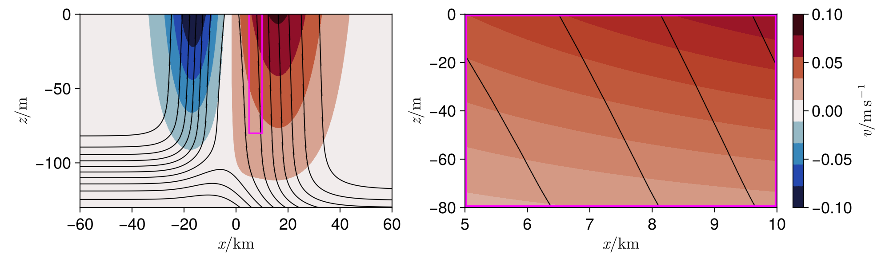

# Ocean fronts

Density fronts are highly anisotropic structures consisting of a horizontal change in density in one *across-front* direction and only gradual changes in an *along-front* direction. In the open ocean, they are primarily created at the edges of large-scale vortices, or seperating boundary currents like the Gulf Stream or Kuroshio current. They can also be created at coasts, such as by inflow of fresh, light water from rivers.

> 
>
> Sea surface temperature from NASA MODIS, November 2020. A cutaway view shows a hypothetical vertical structure of temperature. Figure from [Taylor and Thompson 2013]()

An important feature of fronts, especially at smaller scales $`{(\text{Ro} \sim 1)}`$, is the secondary circulation that forms due to the effect of the background flow or forcing by winds or cooling at the ocean surface. This circulation transports fluid around the front and is responsible for an intense vertical transport of heat, carbon and nutrients. 

Strong fronts may also be susceptible to instabilities. In this module we will explore the evolution of such a front and the consequences of instability for the vertical transport of fluid properties.

## Describing an ideal front
> 
> 
> Left: some kind of frontal structure in the surface mixed layer. Black contours are isopycnals (lines of constant $`b`$) and the filled contours show the balanced along-front velocity $`v`$. A magenta box surrounds the region of interest. Right: The same structure, but zoomed in. The spacing between contours is reduced by a factor of three for clarity. In this region, the gradients in $`b`$ and $`v`$ are approximately constant.

We use a linearised state to define an ideal front with constant horizontal and vertical buoyancy gradients, as well as a balanced thermal wind jet whose orientation we choose to be along $\hat y$ without loss of generality, namely,
```math
b_0 = N^2z + M^2 x \quad \text{and} \quad v_0  = \zeta x +Sz= \zeta x + \frac{M^2}{f} z,
```
where we assume that $v_0 = \zeta x$ on $z=0$. Note that the use of $`N^2`$ and $`M^2`$ does not imply that these quantities must be positive, they are simply the gradients of the background state.

> ### Exercise 2.1
>
> Verify that the fields above are indeed in thermal wind balance.

## Flow around an ideal front
The total flow is the sum of the frontal flow itself ($`{v_0\hat y, b_0}`$) and any perturbations (note the change in notation for $`{\vec u, b}`$), namely,
```math
\vec u_\text{tot} = v_0\hat y + \vec u,  \quad b_\text{tot} = b_0 + b\quad\text{and}\quad \phi_\text{tot}= \int_0^z b_0(x, z') \,\text{d}z' + \phi. \qquad  (2.1)
```
We can substitute these into the Boussinesq equations for $`{(\vec u_\text{tot} , b_\text{tot})}`$ to get similar equations for $`{(\vec u, b)}`$, but with additional _forcing_ terms due to the background $`{(v_0\hat y, b_0)}`$.

```math
\frac{\text{D}\vec u}{\text{D}t} + f \hat z \times \vec u = -\nabla \phi + b\hat z - \left (\zeta u + \frac{M^2}{f}w\right )\hat y, \qquad (2.2a)\\ \frac{\text{D}b}{\text{D}t} = - N^2 w - M^2 u\quad \text{and}\quad \nabla \cdot \vec u = 0. \qquad (2.2b, c)
```

We will simulate these equations to produce a solution for $`{(\vec u, b)}`$. We can then recover the total flow using equations $`{(2.1)}`$.

# Instability in a front

This subsection covers the basic instability theory for our frontal problem. It is the most mathematically involved, and the exercises are optional, but we encourage readers with some experience with linear stability analysis to attempt them. For simplicity, we now turn to motions that evolve on time scales much longer than $`{N^{-1}}`$.

> ### Exercise 2.2
> 
> A. Using the equation for $`{\text{D}w/\text{D}t}`$, show that, under the condition highlighted above, one can neglect the vertical acceleration of perburbations. What is this approximation called?
>
> B. Using this approximation, show that equation set $`(2.2)`$ may be written, keeping only linear terms and ignoring $y$ variation, as
> 
> ```math
> \frac{\partial u}{\partial t} - fv = -\frac{\partial \phi}{\partial x}, \quad \frac{\partial v}{\partial t} + fu = -\zeta u-\frac{M^2}{f}w \\
> \text{and} \quad \frac{\partial b}{\partial t}= -M^2 u-N^2w,
> ```
> 
> with $`{{\partial \phi}/{\partial z} = b}`$ and $`{\nabla \cdot \vec u = 0}`$.
> 
> C. Show that a plane-wave mode $`{(u, v, w, b) = (\tilde u, \tilde v, \tilde w, \tilde b)\exp[\text i(kx + mz - \omega t)]}`$ evolving in an infinitely long domain follows the dispersion relationship
> 
> ```math
> \omega^2 = f(f + \zeta) + \frac{1}{m^2}\left (N^2k^2 - 2M^2km\right ) \qquad (2.3)
> ```
> 
> Hint: construct a differential equation for $u$ only, then use the plane wave assumption.
>
Instability (i.e., modes with $`{\omega^2 < 0}`$) can clearly occur for $`{f(f + \zeta) < 0}`$ or $`{N^2 < 0}`$. These are inertial and gravitational instabilities respectively and will not be the focus of this example. Even if those two conditions are not met, a sufficiently large $`M^2`$ can produce a third form of instability.

> ### Exercise 2.3
> A: For positive $`f`$, show that the condition for stability in equation $`{(2.3)}`$ is that the potential vorticity $q$ is positive, where
> 
> ```math
> q = (\nabla \times \vec u_0 + f\hat z) \cdot \nabla b_0 = (f + \zeta)N^2 - \frac{M^4}{f}.
> ```
> 
> What is the relationship between $k$ and $m$ for the most unstable plane-wave mode?
>
> Hint: a plane wave perturbation is stable if it has $`\omega^2 > 0`$, so find the condition for this to be satisfied for all possible plane waves.
>
> B: Using the previous result, show that
> ```math
> {\begin{pmatrix}\tilde u \\ \tilde v \\ \tilde w\end{pmatrix} \cdot \nabla b_0 = 0.}
> ```
> Hence sketch the flow due to the most unstable mode.

Symmetric instability consists of thin rolls aligned with isopycnals (lines of constant $`b_0`$) in the hydrostatic case and with no variation in the down-front ($`y`$) direction, hence the name. Symmetric instability has some quirks which may be of interest
 - When treated with care in a bounded domain, the growth rate can be shown to be maximized for modes with $`k \to \infty`$ [(Stone 1966)](https://doi.org/10.1175/1520-0469(1966)023%3C0390:ONGBS%3E2.0.CO;2)
 - Correct treatment for deep/non-hydrostatic flows requires non-traditional effects ($`{\vec \Omega \not\parallel \hat{z}}`$) [(Zeitlin 2018)](https://doi.org/10.1063/1.5031099)
 - The full evolution is quite sensitive to details of the viscosity/diffusivity, even if they are very small.
 - Its stability parameter, $`q`$, is materially conserved if fluid parcels conserved momentum and buoyancy.

> ### Exercise 2.4
> Potential vorticity is typically thought of as a materially conserved property $`{(\text{D}q/\text{D}t=0}`$, see Vallis $`\S\,4.5)`$ and this is true for the inviscid Boussinesq equations $`{(1.2)}`$ presented previously. This presents a problem: an unstable fluid parcel with $`{q<0}`$ will remain unstable to SI no matter how much perturbations attempt to restore the fluid to a stable state. What may resolve this contradiction?
>

For the rest of this module, we will be using a background state with $`{\zeta = 0}`$. In this case, the stability of a balanced flow to SI is controlled by a single non-dimensional number, namely,

```math
q = fN^2\left (1 - \frac{M^4}{N^2f^2}\right ) = fN^2\left (1 - \frac{S^2}{N^2}\right )\\ = fN^2 \left ( 1- \frac{1}{\text{Ri}}\right) \quad \text{with} \quad \text{Ri} = \frac{N^2}{S^2}.
```

The Richardson number $`\text{Ri}`$ is the ratio of fluid stratification to vertical shear of velocity. Instability due to a velocity shear is one of the first type of fluid instability one learns about (e.g. Kelvin-Helmholtz). However, fluid with a large Richardson number, like that of most large-scale ocean flows, is very well-supported by gravity -- low density on top of much higher density -- which counteracts the destabilising effect of velocity shear if $`\text{Ri} > 0.25`$. Symmetric instability is the dominant instability for background flows with $`0.25 < \text{Ri} < 1`$ [(Stone 1966)](https://doi.org/10.1175/1520-0469(1966)023%3C0390:ONGBS%3E2.0.CO;2).

Finally, we are ready to proceed with the fun part of the module. A rough outline of the remaining content is as follows.

1. Simulate a simple state with a known Richardson number.
2. Inspect the resulting instability by creating an animation.
3. Repeat for other values of $`\text{Ri}`$.
4. Compare the growth of the instability as $`\text{Ri}`$ changes
