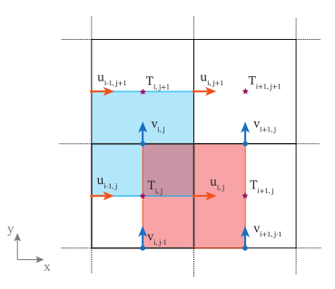

# Basic Oceananigans setup
## Grid
[Grids · Oceananigans.jl](https://clima.github.io/OceananigansDocumentation/stable/grids/)

In brief, Oceananigans is a finite-difference simulator of the Boussinesq equations. This is in contrast to some other methods of producing solutions to PDEs (such as Dedalus, a Python package that uses _spectral_ methods). Quantities such as velocities and tracers are stored as arrays in memory that represent the values at specific points in physical space. We will refer to these as _fields_. We will focus on the `RectilinearGrid` structure, though Oceananigans supports other grid types. A basic definition of a 2D grid is as follows:
```julia
grid = RectilinearGrid(CPU();
    topology = (Periodic, Bounded, Flat),
    size = (32, 32),
    x = (-0.5, 0.5),
    y = (-0.5, 0.5)
)
```
```
32×32×1 RectilinearGrid{Float64, Periodic, Bounded, Flat} on CPU with 3×3×0 halo
├── Periodic x ∈ [-0.5, 0.5) regularly spaced with Δx=0.03125
├── Bounded  y ∈ [-0.5, 0.5] regularly spaced with Δy=0.03125
└── Flat z
```
This creates a rectilinear ($x$ spacing may change only as a function of $x$ and so on) grid that is:
- stored on the CPU (that is, in RAM rather than VRAM)
- periodic in the $x$ direction
- has a wall at the $y$ boundaries
- has no $z$ direction (it's "flat")

The grid size is $32\times 32$ and the _physical_ size (i.e. the length and width of the physical domain it represents) is $1\times 1$, centered on the origin.

Note the lack of units in the definition.  If you would prefer, you can use some pre-defined units to write your code [Library · Oceananigans.jl](https://clima.github.io/OceananigansDocumentation/stable/appendix/library/#Units). I'm going to continue without these however, because we may be performing non-dimensional simulations.

> ### Exercise 1
> Add a basic definition of a grid to `simulation.jl` using the parameters L, H, Nx and Nz in the script. The grid should be periodic in the x direction and bounded at the top and bottom in the z direction.

### Domain boundaries and halos
Oceananigans represents boundary conditions by including them in the fields themselves. Once a field's boundary conditions are defined, a region outside of the grid (as defined by the user) is filled with values that satisfy said boundary condition. So, when you define a grid with `size=(32, 32)` the actual size in memory is (by default) $38 \times 38(\times 1)$. Values on the grid are defined using `OffsetArray`, and have indices `-2:35`. This boundary region is referred to as the _halo_ and the region of the full grid that isn't the halo is the _interior_. Specifying boundary conditions is introduced later in this tutorial.

### Staggering - `Face`s and `Center`s
As an optimisation, different fields "live" on different grid nodes. If the grid is visualised as a lattice of cuboids:
- Centers: the point in the center of each cuboid. Coordinates of cell centers on a `RectilinearGrid` are given by 
	- `xnodes(grid, Center(); with_halos=true)`
	- `ynodes(grid, Center(); with_halos=true)`
	- `znodes(grid, Center(); with_halos=true)`
- Faces: the point at the boundary between two adjacent cuboids. Coordinates of cell faces on a `RectilinearGrid` are given by 
	- `xnodes(grid, Face(); with_halos=true)`
	- `ynodes(grid, Face(); with_halos=true)`
	- `znodes(grid, Face(); with_halos=true)`

`with_halos=false` (the default) will return a view of the interior coordinates only. A 2D representation of this is shown below (figure 10 in [Wagner et al. 2025](https://doi.org/10.48550/arXiv.2502.14148)):



Fields will in general come with three _locations_ that define their position within a cell. As a rule:
- $x$-velocity ($u$) is on  `Face`, `Center`, `Center`. So `u[i, j, k]` would be the velocity at `node(i, j, k, grid, Face(), Center(), Center())` and so on for $v$ and $w$
- Tracers, such as temperature are entirely on grid centers `Center, Center, Center`.
- Each order of a derivative "flips" the corresponding location, so $\frac{\partial T}{\partial x}$ would be on `Face`, `Center`, `Center`

Derived fields may exist on whatever set of locations, for instance the vertical vorticity $\zeta = \frac{\partial v}{\partial x} - \frac{\partial u}{\partial y}$ naturally falls onto `Face`, `Face`, `Center`.

There is a secret, third thing: `Nothing`. This is the location for fields that are the result of a `Reduction`, which we will look at later. A reduction takes a field and "reduces" it in one or more directions (such as an average or integral).
 
Note that staggering the grid in this way makes no difference to the physics that it's representing, this is purely an optimisation for the simulation. We could have every velocity and tracer be on the same set of grid nodes, but then we would have to do an extra set of interpolation operations every timestep to achieve the same numerical accuracy.

## Fields
[Fields · Oceananigans.jl](https://clima.github.io/OceananigansDocumentation/stable/fields/)

A `Field` is a container that holds values of a quantity on a specific grid, along with boundary conditions, nodes and other data. Fields may also be used to represent derived quantities that are produced by `AbstractOperations` acting on fields, described later. To create a field on a grid, just use the constructor `Field`
```julia
c = Field{Center, Center, Center}(grid)
```
```
32×32×1 Field{Center, Center, Center} on RectilinearGrid on CPU
├── grid: 32×32×1 RectilinearGrid{Float64, Periodic, Bounded, Flat} on CPU with 3×3×0 halo
├── boundary conditions: FieldBoundaryConditions
│   └── west: Periodic, east: Periodic, south: ZeroFlux, north: ZeroFlux, bottom: Nothing, top: Nothing, immersed: ZeroFlux
└── data: 38×38×1 OffsetArray(::Array{Float64, 3}, -2:35, -2:35, 1:1) with eltype Float64 with indices -2:35×-2:35×1:1
    └── max=0.0, min=0.0, mean=0.0
```
The type parameters determine the field's location. Elements in a field can be accessed as arrays:
```julia
c[1, 1, 1]
```
```
0.0
```
Note that the interior indices of the field are `(1:grid.Nx, 1:grid.Ny, 1:grid.Nz)`. To access the halo, simply index outside of this region:
```julia
c[0, 1, 1]
```
```
0.0
```
Going too far will take you out of the halo and produce an error
```julia
c[-3, 1, 1]
```
```
ERROR: BoundsError: attempt to access 38×38×1 OffsetArray(::Array{Float64, 3}, -2:35, -2:35, 1:1) with eltype Float64 with indices -2:35×-2:35×1:1 at index [-3, 1, 1]
```
Fields can be `set!` with functions or arrays or other fields
```julia
c_func(x, y) = x * y
c_data = [c_func(x, y) for x in xnodes(c), y in ynodes(c)]

set!(c, c_func)
# or
set!(c, c_data)

c
```
```
32×32×1 Field{Center, Center, Center} on RectilinearGrid on CPU
├── grid: 32×32×1 RectilinearGrid{Float64, Periodic, Bounded, Flat} on CPU with 3×3×0 halo
├── boundary conditions: FieldBoundaryConditions
│   └── west: Periodic, east: Periodic, south: ZeroFlux, north: ZeroFlux, bottom: Nothing, top: Nothing, immersed: ZeroFlux
└── data: 38×38×1 OffsetArray(::Array{Float64, 3}, -2:35, -2:35, 1:1) with eltype Float64 with indices -2:35×-2:35×1:1
    └── max=0.234619, min=-0.234619, mean=0.0
```
Because the grid has no $z$ dependence, the function we pass must only have two arguments.

## Components of a model
[Model Setup · Oceananigans.jl](https://clima.github.io/OceananigansDocumentation/stable/models/models_overview/)

### Forcing
[Forcings · Oceananigans.jl](https://clima.github.io/OceananigansDocumentation/stable/models/forcing_functions/)

Recall the equations we need to simulate
$$
\frac{\text{D}\vec u}{\text{D}t} + f \hat z \times \vec u = -\nabla \phi + b\hat z - \frac{M^2}{f}w\hat y,\quad \frac{\text{D}b}{\text{D}t} = - N^2 w - M^2 u\quad \text{and}\quad \nabla \cdot \vec u = 0.
$$
These contain terms in addition to the rotating Boussinesq equations that represent interaction between the background state and the simulated flow. We can add these terms to the right hand side of our model equations using Oceananigans's `Forcing` constructor. A simple, constant forcing can be created by passing a function to `Forcing`.
```julia
Fᵤ = 0.1
function u_forcing_func(x, y, z, t, p)
	return p.Fᵤ
end

Forcing(u_forcing_func; parameters=(; Fᵤ))
```
```
ContinuousForcing{@NamedTuple{Fᵤ::Float64}}
├── func: u_forcing_func (generic function with 1 method)
├── parameters: (Fᵤ = 0.1,)
└── field dependencies: ()
```

We can also have the forcing functions depend on the value of model fields at the same location, which are added after the coordinates. (though `parameters` is always passed to the last positional argument)
```julia
function quadratic_drag_u(x, y, z, t, u, v, w, p)
	return -p.c * sqrt(u^2 + v^2 + w^2) * u
end

Forcing(quadratic_drag_u;
	parameters = (; c=0.5),
	field_dependencies = (:u, :v, :w)
)
```
```
ContinuousForcing{@NamedTuple{c::Float64}}
├── func: quadratic_drag_u (generic function with 1 method)
├── parameters: (c = 0.5,)
└── field dependencies: (:u, :v, :w)
```
Note that, just like for `set!`, `Flat` coordinates are omitted from these forcing functions.

> ### Exercise 2
> Define the continuous forcing functions `v_forcing_func(x, z, t, p)` and `b_forcing_func(x, z, t, p)` appropriately

### Boundary conditions

[Boundary conditions · Oceananigans.jl](https://clima.github.io/OceananigansDocumentation/stable/model_setup/boundary_conditions/)

Every field comes with a set of boundary conditions
- `ValueBoundaryCondition` represents boundary conditions which constrain the value of a particular field i.e. the no-slip boundary condition $u(x, y, 0) = 0$
- `GradientBoundaryCondition` represents boundary conditions which constrain the gradient, rather than the value of a field
- `FluxBoundaryCondition` is not quite a boundary condition, but a forcing at the boundary that produces a specific flux (density) of a field across that boundary
- `OpenBoundaryCondition` allows you to set the halo regions explicitly, and is useful for performing, for example, simulations of small-scale features forced by some pre-computed larger-scale simulation at the boundaries

There are also boundary conditions which aren't intended to be used directly
- `PeriodicBoundaryCondition` applies to any field on a grid with a periodic direction. This fills the halo with the value of the field on the other side of the domain
- `NoFluxBoundaryCondition` is the default boundary condition for bounded directions. At each boundary, wall-normal velocities are zero e.g. $u(0, y, z) = 0$ and all other fields have zero gradient

To apply a boundary condition to a model, you first have to define a corresponding function (or constant)

### Tracers
[Tracers · Oceananigans.jl](https://clima.github.io/OceananigansDocumentation/stable/model_setup/tracers/)

Passive tracers may be inserted into the model with the keyword argument `tracers`. To add a field $c$ that is evolved by the model using
$$
\frac{\text{D}c}{\text{D}t} = 0
$$
just add
```julia
tracers = (:c, ),
```

[Buoyancy models and equation of state · Oceananigans.jl](https://clima.github.io/OceananigansDocumentation/stable/model_setup/buoyancy_and_equation_of_state/)

Buoyancy $b$ is an *active* tracer that appears in the momentum equation. Any active tracer can be implemented in Oceananigans, but since buoyancy is so common it has dedicated syntax. To include a basic buoyancy in the model, you need the following keyword arguments
```julia
buoyancy = BuoyancyTracer(),
tracers = (:b, ),
```
Note we can add any additional tracers, we just need `:b` present to represent the buoyancy.

### Advection
The advection terms are non-linear, and typically require special treatment for good numerical performance (this is the reason for the staggered grid). Over time, people have developed many methods for calculating these terms. Oceananigans supports a few different schemes:
- `Centered(; order)`: Interpolates values of fields using even `order` polynomials.
- `UpwindBiased(; order)`: Interpolates values of fields using odd `order` polynomials.
- `WENO(; order)`: Like `UpwindBiased`, but adaptively chooses from the results of interpolations using polynomials of lower order to avoid interpolating across sharp changes in an advected quantity, preserving these sharp features. For smoothly varying fields, the order is `order`, while the minimum order is `(order - 1) / 2`.

[Durran 2010](https://link.springer.com/book/10.1007/978-1-4419-6412-0) presents some background for how these work. We will use a fifth-order WENO.
### Closure
[Turbulent diffusivity closures and LES models · Oceananigans.jl](https://clima.github.io/OceananigansDocumentation/stable/model_setup/turbulent_diffusivity_closures_and_les_models/)

When we simulate a fluid on a computer, we necessarily lose some information as we can only represent a finite range of length scales. Motion at smaller length scales is still important for realistic motion of a fluid, and must be represented in some way in a model. A closure is some representation of the effect of these small scales on the simulated flow. A simple example would be an effective viscosity term $\nu\nabla^2\vec u$ to model down-gradient turbulent diffusion of velocity.

We will not use an explicit closure here for simplicity; the WENO advection scheme is sufficient.

### Initial conditions
> ### Exercise 3
> Create a function `c₀(x, z)` with your desired initial conditions of the tracer $c$

## Simulation
### Creation
### Variable time steps
### Progress info

### Output
> ### Exercise 4
> Add an abstract operation to the output that computes the total buoyancy gradient $N^2 + \frac{\partial b}{\partial z}$

### Running
Once configured, a simulation can be run with simply
```julia
run!(simulation)
```

> ### Exercise 5
> Run the simulation. At $512\times 64$ resolution, it took about 15 minutes on my laptop (Ryzen 5 7640U, 12 threads) and the output file was ~500 MB. You can reduce the resolution if it takes too long (keep the aspect ratio 16:1, 8:1 or 4:1), or save timesteps less often if space is an issue.

