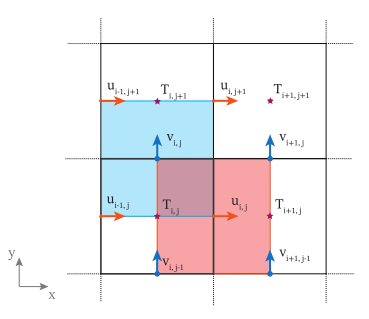

# Basic Oceananigans setup
## Grid

[Grids · Oceananigans.jl](https://clima.github.io/OceananigansDocumentation/stable/grids/) _*(NICO MADE IT POINT TO STABLE VERSION, NOT SURE IT'S WHAT WE WANT)*_

In brief, Oceananigans is a finite-volume simulator of the Boussinesq equations. This is in contrast to some other methods of producing solutions to PDEs (such as [Dedalus](https://dedalus-project.org/), a Python package that uses _spectral_ methods). Quantities such as velocities and tracers are stored as arrays in memory that represent the values at specific points in physical space. We will refer to these as _fields_. We will focus on the `RectilinearGrid` structure, though Oceananigans supports other grid types. A basic definition of a 2D grid is as follows:
```julia
grid = RectilinearGrid(CPU();
    topology = (Periodic, Bounded, Flat),
    size = (32, 32),
    x = (-0.5, 0.5),
    y = (-0.5, 0.5)
)
```
```
32×32×1 RectilinearGrid{Float64, Periodic, Bounded, Flat} on CPU with 3×3×0 halo
├── Periodic x ∈ [-0.5, 0.5) regularly spaced with Δx=0.03125
├── Bounded  y ∈ [-0.5, 0.5] regularly spaced with Δy=0.03125
└── Flat z
```
This creates a rectilinear ($x$ spacing may change only as a function of $x$ and so on) grid that is:
- stored on the CPU (that is, in RAM rather than VRAM)
- periodic in the $x$ direction
- has a wall at the $y$ boundaries
- has no $z$ direction (it's "flat")

The grid size is $32\times 32$ and the _physical_ size (i.e. the length and width of the physical domain it represents) is $1\times 1$, centered on the origin.

Note the lack of units in the definition.  If you would prefer, [you can use some pre-defined units to write your code](https://clima.github.io/OceananigansDocumentation/stable/appendix/library/#Units). I'm going to continue without these however, because we may be performing non-dimensional simulations.

> ### Exercise 3.1
> Add a 2D grid to `simulation.jl` using the parameters `L`, `H`, `Nx` and `Nz` in the script. The grid should be periodic in the $x$ direction and bounded at the top and bottom in the $z$ direction.

### Domain boundaries and halos
Oceananigans represents boundary conditions by including them in the fields themselves. Once a field's boundary conditions are defined, a region outside of the grid (as defined by the user) is filled with values that satisfy said boundary condition. So, when you define a grid with `size=(32, 32)` the actual size in memory is (by default) $38 \times 38(\times 1)$. Values on the grid are defined using `OffsetArray`, and have indices `-2:35`. This boundary region is referred to as the _halo_ and the region of the full grid that isn't the halo is the _interior_. Specifying boundary conditions is introduced later in this tutorial.

### Staggering - `Face`s and `Center`s
As an optimisation, different fields "live" on different grid nodes. If the grid is visualised as a lattice of cuboids:
- Centers: the point in the center of each cuboid. Coordinates of cell centers on a `RectilinearGrid` are given by 
	- `xnodes(grid, Center(); with_halos=true)`
	- `ynodes(grid, Center(); with_halos=true)`
	- `znodes(grid, Center(); with_halos=true)`
- Faces: the point at the boundary between two adjacent cuboids. Coordinates of cell faces on a `RectilinearGrid` are given by 
	- `xnodes(grid, Face(); with_halos=true)`
	- `ynodes(grid, Face(); with_halos=true)`
	- `znodes(grid, Face(); with_halos=true)`

`with_halos=false` (the default) will return a view of the interior coordinates only. A 2D representation of this is shown below (figure 10 in [Wagner et al. 2025](https://doi.org/10.48550/arXiv.2502.14148)):



Fields will in general come with three _locations_ that define their position within a cell. As a rule:
- $x$-velocity ($u$) is on  `Face`, `Center`, `Center`. So `u[i, j, k]` would be the velocity at `node(i, j, k, grid, Face(), Center(), Center())` and so on for $v$ and $w$.
- Tracers such as temperature are entirely on grid centers `Center, Center, Center`.
- Each order of a derivative "flips" the corresponding location, so $\partial_x T$ would be on `Face`, `Center`, `Center`.

Derived fields may exist on whatever set of locations, for instance the vertical vorticity $\zeta = \partial_x v - \partial u_y$ naturally falls onto `Face`, `Face`, `Center`.

There is a secret, third thing: `Nothing`. This is the location for fields that are the result of a `Reduction`, which we will look at later. A reduction takes a field and "reduces" it in one or more directions (such as an average or integral).
 
Note that staggering the grid in this way makes no difference to the physics that it's representing, this is purely an optimisation for the simulation. We could have every velocity and tracer be on the same set of grid nodes, but then we would have to do an extra set of interpolation operations every timestep to achieve the same numerical accuracy.

## Fields
[Fields · Oceananigans.jl](https://clima.github.io/OceananigansDocumentation/stable/fields/)

A `Field` is a container that holds values of a quantity on a specific grid, along with boundary conditions, nodes and other data. Fields may also be used to represent derived quantities that are produced by `AbstractOperations` acting on fields, described later. To create a field on a grid, just use the constructor `Field`
```julia
c = Field{Center, Center, Center}(grid)
```
```
32×32×1 Field{Center, Center, Center} on RectilinearGrid on CPU
├── grid: 32×32×1 RectilinearGrid{Float64, Periodic, Bounded, Flat} on CPU with 3×3×0 halo
├── boundary conditions: FieldBoundaryConditions
│   └── west: Periodic, east: Periodic, south: ZeroFlux, north: ZeroFlux, bottom: Nothing, top: Nothing, immersed: ZeroFlux
└── data: 38×38×1 OffsetArray(::Array{Float64, 3}, -2:35, -2:35, 1:1) with eltype Float64 with indices -2:35×-2:35×1:1
    └── max=0.0, min=0.0, mean=0.0
```
The type parameters determine the field's location. Elements in a field can be accessed as arrays:
```julia
c[1, 1, 1]
```
```
0.0
```
Note that the interior indices of the field are `(1:grid.Nx, 1:grid.Ny, 1:grid.Nz)`. To access the halo, simply index outside of this region:
```julia
c[0, 1, 1]
```
```
0.0
```
Going too far will take you out of the halo and produce an error
```julia
c[-3, 1, 1]
```
```
ERROR: BoundsError: attempt to access 38×38×1 OffsetArray(::Array{Float64, 3}, -2:35, -2:35, 1:1) with eltype Float64 with indices -2:35×-2:35×1:1 at index [-3, 1, 1]
```
Fields can be `set!` with functions or arrays or other fields
```julia
c_func(x, y) = x * y
c_data = [c_func(x, y) for x in xnodes(c), y in ynodes(c)]

set!(c, c_func)
# or
set!(c, c_data)

c
```
```
32×32×1 Field{Center, Center, Center} on RectilinearGrid on CPU
├── grid: 32×32×1 RectilinearGrid{Float64, Periodic, Bounded, Flat} on CPU with 3×3×0 halo
├── boundary conditions: FieldBoundaryConditions
│   └── west: Periodic, east: Periodic, south: ZeroFlux, north: ZeroFlux, bottom: Nothing, top: Nothing, immersed: ZeroFlux
└── data: 38×38×1 OffsetArray(::Array{Float64, 3}, -2:35, -2:35, 1:1) with eltype Float64 with indices -2:35×-2:35×1:1
    └── max=0.234619, min=-0.234619, mean=0.0
```
Because the grid has no $z$ dependence, the function we pass must only have two arguments. This convention is used throughout Oceananigans. Functions defined on the simulation domain will take arguments `(x, y, z)` or `(x, y, z, t)`, with coordinates corresponding to flat directions removed.

## Components of a model
[Model Setup · Oceananigans.jl](https://clima.github.io/OceananigansDocumentation/stable/models/models_overview/)

The model contains information and implementation of the physics of the simulation. We will use a `NonhydrostaticModel`, though others exist. The model constructor takes many keyword arguments specifying desired properties. For our simulation, the model may look like:

```julia
model = NonhydrostaticModel(; 
    grid,
    advection,
    forcing,
    coriolis,
    tracers,
    buoyancy
)
```
Each of the arguments we use are described below.

### Rotation
[Coriolis forces · Oceananigans.jl](https://clima.github.io/OceananigansDocumentation/stable/models/coriolis/)

After defining the desired Coriolis frequency $f$, a simple $f$-plane rotation can be added with 
```julia
coriolis = FPlane(; f)
```

### Forcing
[Forcings · Oceananigans.jl](https://clima.github.io/OceananigansDocumentation/stable/models/forcing_functions/)

Recall the equations we need to simulate:

$$\frac{\text{D}\vec u}{\text{D}t} + f \hat z \times \vec u = -\nabla \phi + b\hat z - \frac{M^2}{f}w\hat y,\quad \frac{\text{D}b}{\text{D}t} = - N^2 w - M^2 u\quad \text{and}\quad \nabla \cdot \vec u = 0.$$

These contain terms in addition to the rotating Boussinesq equations that represent interaction between the background state and the simulated flow. We can add these terms to the right hand side of our model equations using Oceananigans's `Forcing` constructor.
Let us now explain in general how to build forcing terms, before turning our attention back to our frontal problem.

A simple, constant forcing can be created by passing a function to `Forcing`.
```julia
Fᵤ = 0.1
function u_forcing_func(x, y, z, t, p)
	return p.Fᵤ
end

forcing = Forcing(u_forcing_func; parameters=(; Fᵤ))
```
```
ContinuousForcing{@NamedTuple{Fᵤ::Float64}}
├── func: u_forcing_func (generic function with 1 method)
├── parameters: (Fᵤ = 0.1,)
└── field dependencies: ()
```

As mentioned [earlier](https://github.com/erin-atkinson/FrontalInstabilities/blob/main/notes/3-simulation.md#components-of-a-model), note how 
- the space and time coordinates are always passed onto the function first, even when said function is constant with respect to them. (But just like for `set!`, we omit `Flat` coordinates.) One way to memorize it is to consider that the forcing, even if constant, applies at all points and all times; 
- The last argument, `p`, stands for "parameters" and is always the last positional argument;
- In the last line, we specificed that the forcing applied to $u$, and what the external parameters were.

We can also have the forcing functions depend on the value of model fields at the same location, which are added after the coordinates (but again, before `parameters`).
```julia
function quadratic_drag_u(x, y, z, t, u, v, w, p)
	return -p.c * sqrt(u^2 + v^2 + w^2) * u
end

forcing = Forcing(quadratic_drag_u;
	parameters = (; c=0.5),
	field_dependencies = (:u, :v, :w)
)
```
```
ContinuousForcing{@NamedTuple{c::Float64}}
├── func: quadratic_drag_u (generic function with 1 method)
├── parameters: (c = 0.5,)
└── field dependencies: (:u, :v, :w)
```
Pay attention to how external parameters and field dependencies are introduced and treated.

> ### Exercise 3.2
> Define the continuous forcing functions `v_forcing_func(...)` and `b_forcing_func(...)`, with arguments to be determined, in a manner that is appropriate to our frontal problem.

### Boundary conditions

[Boundary conditions · Oceananigans.jl](https://clima.github.io/OceananigansDocumentation/stable/models/boundary_conditions/)

Every field comes with a set of boundary conditions:
- `ValueBoundaryCondition` represents boundary conditions that constrain the value of a particular field, for example the no-slip boundary condition $u(x, y, 0) = 0$;
- `GradientBoundaryCondition` represents boundary conditions that constrain the gradient, rather than the value of a field;
- `FluxBoundaryCondition` is not quite a boundary condition, but a forcing at the boundary that produces a specific flux (density) of a field across that boundary;
- `OpenBoundaryCondition` allows you to set the halo regions explicitly, and is useful for performing, for example, simulations of small-scale features forced by some pre-computed larger-scale simulation at the boundaries.

There are also boundary conditions that aren't intended to be used directly:
- `PeriodicBoundaryCondition` applies to any field on a grid with a periodic direction. This fills the halo with the value of the field on the other side of the domain;
- `NoFluxBoundaryCondition` is the default boundary condition for bounded directions. At each boundary, wall-normal velocities are zero e.g. $u(0, y, z) = 0$ and all other fields have zero gradient.

Boundary conditions can be applied just like forcings. We will not modify the default boundary conditions here, so can just pass `nothing` to the model.
```julia
boundary_conditions = nothing
```

### Tracers and buoyancy

[Buoyancy models and equation of state · Oceananigans.jl](https://clima.github.io/OceananigansDocumentation/stable/models/buoyancy_and_equation_of_state/)

Passive tracers may be inserted into the model with the keyword argument `tracers`. To add an unforced field $c$ that is evolved by the model using

$$\frac{\text{D}c}{\text{D}t} = 0,$$

just add
```julia
tracers = (:c, )
```

Buoyancy $b$ is an *active* tracer, that is, it appears in the momentum equation. Any active tracer can be implemented in Oceananigans using custom forcing functions, but since buoyancy is so common it has dedicated syntax. To include a basic buoyancy in the model, you need the following keyword arguments
```julia
buoyancy = BuoyancyTracer()
tracers = (:b, )
```
Note we can add any additional tracers, we just need `:b` present to represent the buoyancy. So we combine the above:

```julia
buoyancy = BuoyancyTracer()
tracers = (:b, :c, )
```

### Advection
The advection terms are non-linear, and typically require special treatment for good numerical performance (this is the reason for the staggered grid). Over time, people have developed many methods for calculating these terms. Oceananigans supports a few different schemes:
- `Centered(; order)`: Interpolates values of fields using even `order` polynomials.
- `UpwindBiased(; order)`: Interpolates values of fields using odd `order` polynomials.
- `WENO(; order)`: Like `UpwindBiased`, but adaptively chooses from the results of interpolations using polynomials of lower order to avoid interpolating across sharp changes in an advected quantity, preserving these sharp features. For smoothly varying fields, the order is `order`, while the minimum order is `(order - 1) / 2`.

[Durran 2010](https://link.springer.com/book/10.1007/978-1-4419-6412-0) presents some background for how these work. We will use a fifth-order WENO as it will allow us to avoid having to spend time tuning the closure (see below).
```julia
advection = WENO(; order=5)
```
```
WENO{3, Float64, Float32}(order=5)
├── buffer_scheme: WENO{2, Float64, Float32}(order=3)
└── advection_velocity_scheme: Centered(order=4)
```
### Closure
[Turbulent diffusivity closures and LES models · Oceananigans.jl](https://clima.github.io/OceananigansDocumentation/stable/models/turbulence_closures/)

When we simulate a fluid on a computer, we necessarily lose some information as we can only represent a finite range of length scales. In particular, energy dissipates at molecular scales, which are impossible to resolve in any oceanic simulation. In order to close the equations of motion, motion at smaller-than-grid-scales must be represented in some way in a numerical model. A closure is some representation of the effect of these small scales on the simulated flow. A simple example would be an effective viscosity term ${\nu\nabla^2\vec{u}}$ with a coefficient that would be larger than the physical value to model down-gradient turbulent diffusion of velocity.

We will not use an explicit closure here for simplicity; the WENO advection scheme is sufficient.

```julia
closure = nothing
```

### Initial conditions
`set!` can be called for models just like fields, with keywords describing what model fields to set:
```julia
set!(model; u=u₀, v=v₀) # etc.
```
We will use this to set the initial conditions of the simulation, after the model has been created.
> ### Exercise 3.3
> Create a function `c₀(x, z)` with your desired initial conditions of the tracer $c$. This can be anything you want, but the simplest non-trivial example is a linear profile, here with 0 at the surface and 1 at the bottom.

## Simulation
[Simulation · Oceananigans.jl](https://clima.github.io/OceananigansDocumentation/stable/simulations/simulations_overview/)
### Creation
We pass the model to a `Simulation`, which controls timestepping, output and other processes associated with actually running the simulation. A simulation takes a model, an initial timestep and a stop condition.
```julia
simulation = Simulation(model; Δt=7, stop_time=6)
```
### Progress info
[Callbacks · Oceananigans.jl](https://clima.github.io/OceananigansDocumentation/stable/simulations/callbacks/)

Oceananigans has a callback system for creating functions that run at specific points during simulation runtime. We will use this to produce some output as the simulation runs. First, we define a function that prints some info (using `prettytime` to convert seconds into a suitable unit)

```julia
function progress(simulation)
    i = iteration(simulation)
    t = prettytime(time(simulation))
    T = prettytime(simulation.stop_time)

    print(rpad("$i, t=$t / $T", 60, ' ') * "\r")
end
```
We then add this to the simulation callbacks.
```julia
simulation.callbacks[:progress] = Callback(progress, TimeInterval(20Δt))
```
### Variable time steps
[Adaptive time stepping · Oceananigans.jl](https://clima.github.io/OceananigansDocumentation/stable/simulations/simulations_overview/#Adaptive-time-stepping-with-TimeStepWizard)

The numerical stability of an advection equation is determined primarily by the _*(SENTENCE WASN'T FINISHED; I (NICO) THINK YOU MEAN TO WRITE COURANT-FRIEDRICHS-LEWY CONDITION, BUT I DON'T KNOW IF YOU'RE GIVING A FORMULA OR NOT.)*_

Intuitively, this condition states that the movement of an advected quantity in one timestep $u\Delta t$ must not be larger than a single grid cell $\Delta x$. We can use this condition as a guide for how large we can make the simulation timestep and retain stability. Since velocity is an evolving quantity, we use a `TimeStepWizard` to adjust the timestep to be as large as possible while still retaining a minimum CFL number of $0.5$.

```julia
wizard = TimeStepWizard(; cfl=0.5)
simulation.callbacks[:wizard] = Callback(wizard, IterationInterval(10))
```

### Output and operations

[Output writers ⋅ Oceananigans.jl](https://clima.github.io/OceananigansDocumentation/stable/simulations/output_writers/)
\
[Operations ⋅ Oceananigans.jl](https://clima.github.io/OceananigansDocumentation/stable/operations/#Operations-and-averaging)

Finally, we add a `JLD2Writer` to the simulation to output model fields. We can also output derived fields using `AbstractOperations`.

```julia
u, v, w = model.velocities
b, c = model.tracers

# Derivatives
∂v∂x = ∂x(v)

# Sums
KE = (u^2 + v^2) / 2
```

> ### Exercise 3.4
> Add an abstract operation `N²_tot` to the output that computes the total buoyancy gradient $N^2 + \partial_z b$.

We can also pass a function as keyword argument `init` that is run when the output file is initialized. It is prudent to output simulation parameters and a short description in addition to fields.

```julia
# Output metadata
function init_jld2!(file, model)
    file["metadata/parameters"] = (; Ri, S, N², f, L, H, Nx, Nz, Δt, T)
    file["metadata/description"] = "Symmetric instability in a frontal zone"
    return nothing
end

# Configure output writer
simulation.output_writers[:output] = JLD2Writer(model, (; u, v, w, b, c, N²_tot);
    filename = "output.jld2",
    overwrite_existing = true,
    init=init_jld2!,
    schedule = TimeInterval(20Δt)
)
```

### Running
Once configured, a simulation can be run with simply
```julia
run!(simulation)
```

> ### Exercise 3.5
> Run the simulation.
> 
> _At_ $512\times 64$ _resolution, it took about 15 minutes on Erin's laptop (Ryzen 5 7640U, 12 threads) and 10 minutes on Nico's laptop (MacBook Pro 2021, Apple M1, the number of threads does not impact the runtime). The output file was ~500 MB. You can reduce the resolution if it takes too long (keep the aspect ratio 16:1, 8:1 or 4:1), or save timesteps less often if space is an issue._
