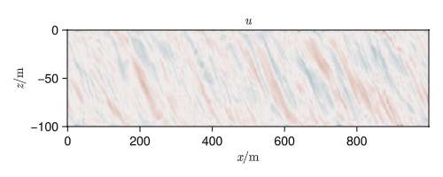
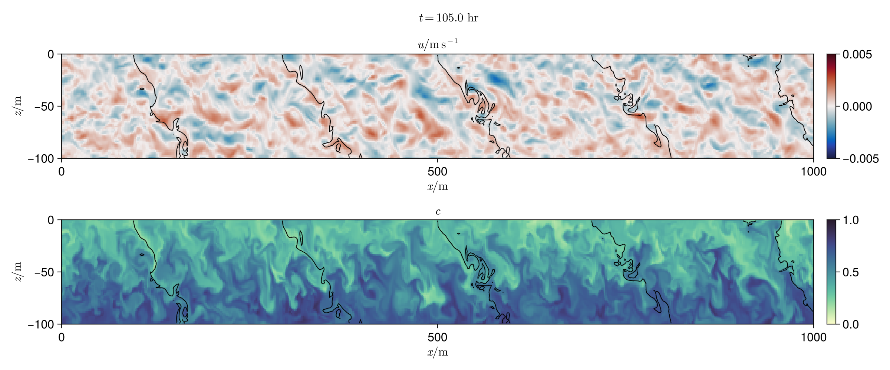

# Making a video of the simulation
Currently, Julia's premier plotting package is `Makie` this comes in two different flavours:
- `CairoMakie` Lightweight, platform-agnostic
- `GLMakie` Uses OpenGL to render figures, notably, this enables 3D plotting and interactive plots

I will refer to both of these as "Makie", but note that you only need to `add` one of the above. There is also a secret, third thing: `WGLMakie` or "WebGL Makie", which is, as the name implies, for embedding in websites.

Simulation output data can be read into memory using `FieldTimeSeries`. This creates an indexable series of model fields. The specific iterations to load, as well as whether to load all into memory or keep them lazily on disk can be specified.
```julia
filename = "output.jld2"
u_timeseries = FieldTimeSeries(filename, "u")
```
Each element of a `FieldTimeSeries` is a `Field`
```julia
u_timeseries[10]
```
```
512×1×64 Field{Face, Center, Center} on RectilinearGrid on CPU
├── grid: 512×1×64 RectilinearGrid{Float64, Periodic, Flat, Bounded} on CPU with 3×0×3 halo
├── boundary conditions: FieldBoundaryConditions
│   └── west: Periodic, east: Periodic, south: Nothing, north: Nothing, bottom: ZeroFlux, top: ZeroFlux, immersed: Nothing
└── data: 518×1×70 OffsetArray(view(::Array{Float64, 4}, :, :, :, 10), -2:515, 1:1, -2:67) with eltype Float64 with indices -2:515×1:1×-2:67
    └── max=1.73368e-8, min=-1.80413e-8, mean=2.27805e-11
```
A `FieldTimeSeries` can also be indexed as if it were a large (offset) array
```julia
u_timeseries[10, 1, 32, 40]
```
```
-1.0188229815355498e-8
```
We can also get the saved times with 
```julia
u_timeseries.times
```
```
601-element Vector{Float64}:
    0.0
 2000.0
 4000.0
 6000.000000000001
 8000.0
    ⋮
    1.1920000000000002e6
    1.194e6
    1.1960000000000002e6
    1.198e6
    1.2e6
```
and coordinate nodes with `xnodes`, etc.. as for `Field`s. We can then plot `u_timeseries` with `GLMakie`. A simple plot of the final state of u can be made with `heatmap`.
## Simple plot
```julia
x = xnodes(u_timeseries)
z = znodes(u_timeseries)

# Index
n = length(u_timeseries)

# Get field interior
u = interior(u_timeseries, :, 1, :, n)

# Create figure
fig = Figure(; size=(500, 200))

# Create axis
ax = Axis(fig[1, 1]; 
    xlabel = L"x / \text{m}",
    ylabel = L"z / \text{m}",
    title = L"u"
)

# Plot
ht = heatmap!(ax, x, z, u;
    colormap = :balance,
    colorrange = (-5e-3, 5e-3)
)

# Save figure object
save("example.png", fig)
```


In 2D, Makie plotting functions typically take an array for the x and y coodinates, as well as a 2D array, or function `f(x, y)` to plot. There are many keyword arguments that may be used to configure a `Figure`, `Axis` or plot, and these can be found in the [documentation](https://docs.makie.org/stable/), or with `?heatmap`, for instance. `L"x / \text{m}"` is an example of a LaTeX string, included in Makie, that allows easily making pretty text in figures. If needed, you can interpolate into these with `%$` rather than `$`.

The [cmocean](https://docs.makie.org/stable/explanations/colors#cmocean) colormaps are common in climate science.

> ### Exercise 1
>
> Add a heatmap of the passive tracer $c$ to `visualization.jl` at grid location `fig[3, 1]` and a colorbar at `fig[3, 2]`
>
> **Hint** Copy and modify the existing code for `ax_u` etc.


## Video
Animations of existing plots is easy to implement using `Makie`'s `Observable` system. Just a few changes to the example code above will save a video. Firstly, replace the integer index `n` with an observable:

```julia
# Index
n = Observable(1)
```
Then make any animated data depend on this observable via the macro `@lift`
```julia
# Get field interior
u = @lift interior(u_timeseries, :, 1, :, $n)
```
and finally, use `record` to capture an animation
```julia
# Save figure object
N = length(u_timeseries)
record(fig, "../videos/example.mp4", 1:N) do i
    n[] = i 
    print("$i / $N\r")
end
```
> ### Exercise 2
>
> Modify the `visualization.jl` to make an animation `Ri05.mp4`
