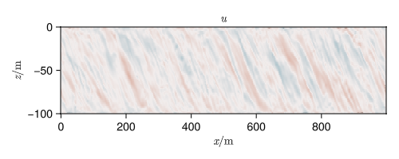
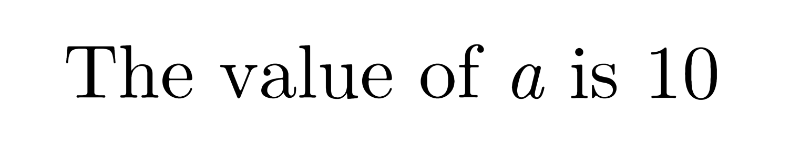
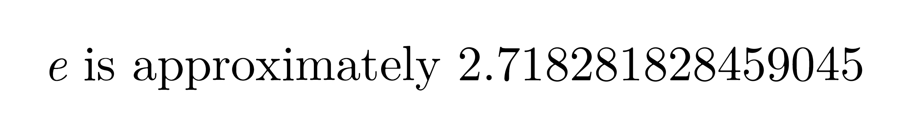
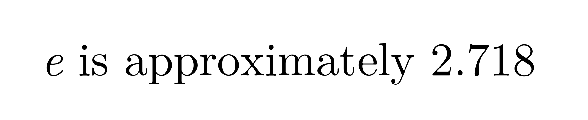
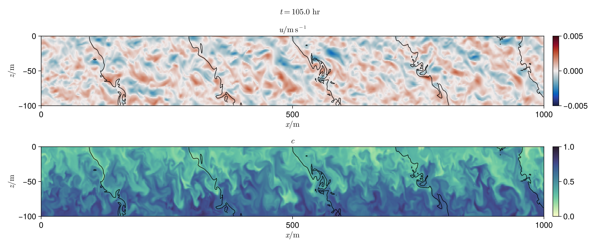

# Making a video of the simulation

This section will use `GLMakie` to produce plots of simulation fields and demonstrate how these can be used to make a video of the simulation output.

## Elements of `Makie`

Currently, Julia's premier plotting package is `Makie` which comes in two different flavours:
- `CairoMakie` Lightweight, platform-agnostic
- `GLMakie` Uses OpenGL to render figures, notably, this enables 3D plotting and interactive plots

I will refer to both of these as "Makie", but note that you only need to `add` one of the above. There is also a secret, third thing: `WGLMakie` or "WebGL Makie", which is, as the name implies, for embedding interactive plots in websites.

## Reading simulation output: `FieldTimeSeries` and `FieldDataset`

[Example use of FieldTimeSeries for simple output](https://clima.github.io/OceananigansDocumentation/v0.102.5/literated/two_dimensional_turbulence/#Visualizing-the-results)

Simulation output data can be read into memory using `FieldTimeSeries`. This creates an indexable series of a field when given a path to the file produced by an output writer, and the name of the field to read. The most important option is perhaps `backend`:

- `backend = InMemory()` is the default, and loads all iterations stored in a file into memory for quick access
- `backend = OnDisk()` will *lazily* load the data; the file is only accessed when indexing into the timeseries

The simulation output here will likely fit in your computer's memory, but if the file is large you may want to consider using `OnDisk()`.

To create a timeseries that contains all the output for $u$, we do
```julia
filename = "output.jld2"
u_fts = FieldTimeSeries(filename, "u"; backend=InMemory())
```
Each element of a `FieldTimeSeries` is a `Field`, and they can be indexed like a 1D array in time
```julia
u = u_fts[10]
```
```
512×1×64 Field{Face, Center, Center} on RectilinearGrid on CPU
├── grid: 512×1×64 RectilinearGrid{Float64, Periodic, Flat, Bounded} on CPU with 3×0×3 halo
├── boundary conditions: FieldBoundaryConditions
│   └── west: Periodic, east: Periodic, south: Nothing, north: Nothing, bottom: ZeroFlux, top: ZeroFlux, immersed: Nothing
└── data: 518×1×70 OffsetArray(view(::Array{Float64, 4}, :, :, :, 10), -2:515, 1:1, -2:67) with eltype Float64 with indices -2:515×1:1×-2:67
    └── max=1.73368e-8, min=-1.80413e-8, mean=2.27805e-11
```
A `FieldTimeSeries` can also be indexed as if it were a large (offset) array, with time as the last index `(x, y, z, t)`
```julia
u_fts[1, 32, 40, 10] # equivalent to u[1, 32, 40]
```
```
-1.0188229815355498e-8
```
We can also get the saved times with 
```julia
u_fts.times
```
```
601-element Vector{Float64}:
    0.0
 2000.0
 4000.0
 6000.000000000001
 8000.0
    ⋮
    1.1920000000000002e6
    1.194e6
    1.1960000000000002e6
    1.198e6
    1.2e6
```
and coordinate nodes with `xnodes`, etc.. as for `Field`s. We can then plot `u_fts` with `GLMakie`. A simple plot of the final state of u can be made with `heatmap`.
## Simple plot
```julia
x = xnodes(u_fts)
z = znodes(u_fts)

# Index
n = length(u_fts)

# Get field interior
u = interior(u_fts[n], :, 1, :)

# Create figure
fig = Figure(; size=(500, 200))

# Create axis
ax = Axis(fig[1, 1]; 
    xlabel = L"x / \text{m}",
    ylabel = L"z / \text{m}",
    title = L"u"
)

# Plot
ht = heatmap!(ax, x, z, u;
    colormap = :balance,
    colorrange = (-5e-3, 5e-3)
)

# Save figure object
save("example.png", fig)
```


In 2D, Makie plotting functions typically take an array for the $x$ and $y$ coordinates, as well as a 2D array, or function `f(x, y)` to plot. There are many keyword arguments that may be used to configure a `Figure`, `Axis` or plot, and these can be found in the [documentation](https://docs.makie.org/stable/), or with `?heatmap`, for instance. 

> ### Aside: LaTeX strings
> `L"x / \text{m}"` is an example of a LaTeX string, included in Makie, that allows easily making pretty text in figures. To include the value of a variable inside a LaTeX string, you can use string interpolation:
>
> ```
> a = 10
> texstr = L"The value of $a$ is %$a"
> ```
> The above would render as 
> 
> Note that you will likely want to format floats before passing them to a LaTeX string, otherwise it will include the whole, unrounded value. The included package `Printf` can be used for this
> 
> ```
> e = exp(1)
> texstr = L"$e$ is approximately %$e"
> ```
> 
> ```
> using Printf
> e_str = @sprintf "%.3f" e
> texstr = L"$e$ is approximately %$e_str"
> ```
> 

The [cmocean](https://docs.makie.org/stable/explanations/colors#cmocean) colormaps or variants are frequently used in climate science, and many have common meanings, which help readers intuit your results.

> ### Exercise 1
>
> Add a heatmap of the passive tracer $c$ to `visualization.jl` at grid location `fig[3, 1]` and a colorbar at `fig[3, 2]`
>
> **Hint** Copy and modify the existing code for `ax_u` etc.



## Video
Animations of existing plots is easy to implement using `Makie`'s `Observable` system. Just a few changes to the example code above will save a video. Firstly, replace the integer index `n` with an observable:

```julia
# Index
n = Observable(1)
```
Then make any animated data depend on this observable via the macro `@lift`
```julia
# Get field interior
u = @lift interior(u_fts, :, 1, :, $n)
```
and finally, use `record` to capture an animation
```julia
# Save figure object
N = length(u_fts.times)
record(fig, "../videos/example.mp4", 1:N) do i
    n[] = i 
    print("$i / $N\r")
end
```
> ### Exercise 2
>
> Modify the `visualization.jl` to make an animation `Ri05.mp4`
> Note that `@lift` must go at the start of the `let` block for `time_string`
> ```julia
> # Time in hours
> time_string = @lift let 
>    t = u_fts.times[$n] / 3600
>    t_str = @sprintf "%.1f" t
>    L"t = %$t_str \, \text{hr}"
>end
> ```