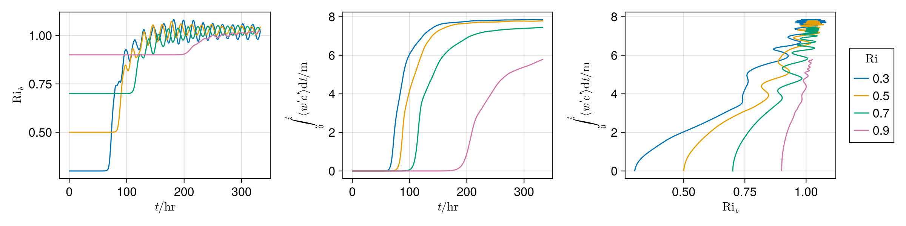

# Analysis
This section covers some motivation for modelling instabilities in the first place in the form of their effect on an averaged state, introduces use of `ARGS` to allow Julia scripts to access command-line arguments, and describes post-processing using Oceananigans.

## Vertical transport
It is clear from the videos that the instability-induced turbulence transports momentum and tracers vertically. As discussed in section 3, a simulation is not a true representation of an inviscid fluid, with the most important difference being a lack of infinite resolution. Our simulation may be contained entirely in a single grid cell within a global ocean model. The value of velocities and tracers within this cell will be the average over the whole simulation, for example the tracer $c$ we define an average and perturbations from this average

$$
\langle c \rangle = \frac{1}{LH}\int_\text{cell} c\;\text{d}x\text{d}z  \quad \text{and}\quad c'=c - \langle c\rangle
$$

How does $\langle c \rangle$ evolve? Well, we can start by considering its Lagrangian derivative.

$$
\frac{\text {D}\langle c \rangle}{\text{D}t} = \frac{\partial \langle c\rangle}{\partial t} + \vec u \cdot \nabla \langle c \rangle
$$
Using $\langle c \rangle = c - c'$ and taking a horizontal average (noting that $\langle \langle a\rangle\rangle = \langle a\rangle$)
$$
\left \langle\frac{\text {D}\langle c \rangle}{\text{D}t}\right \rangle = \left \langle\frac{\partial c}{\partial t}\right \rangle + \langle\vec u \cdot \nabla c\rangle -  \langle\vec u \cdot \nabla c'\rangle = \left \langle\frac{\text {D} c }{\text{D}t}\right \rangle - \langle \vec u \cdot \nabla c'\rangle =  - \langle \vec u' \cdot \nabla c'\rangle = - \nabla \cdot \langle \vec u' c'\rangle 
$$
Where incompressibility is used for the final equality. We end up with a tracer equation for $\langle c \rangle$, but this averaged tracer is no longer materially conserved as it has a non-zero Lagrangian derivative
$$
\frac{\text {D}\langle c \rangle}{\text{D}t} =- \nabla \cdot \langle \vec u' c'\rangle 
$$
(note that there will also be a direct effect of the sub-grid diffusivity due to the advection scheme/closure as discussed previously, but we ignore it here). As simulations at this fine resolution are impractical for larger regions, realistic simulations require that we model the effects of small-scale turbulence by producing estimates of the turbulent flux terms $\langle \vec u' c'\rangle $ (this _closes_ the set of equations for the averaged fields, hence the term _closure_). This can be done completely analytically for only simple cases, another method is to perform multiple small-scale simulations for a range of large-scale conditions, usually represented by non-dimensional numbers, and fit a curve. Here we will produce an estimate of the total vertical transport of the tracer $c$ for different values of $\text{Ri}$ over time.

## Parameter sweep

It would be impractical to edit `simulation.jl` each time we want to change some parameters. We can make use of the `ARGS` variable to run multiple versions of the same simulation. `ARGS` is a Julia environment variable that contains a vector of the command-line arguments the script was run with (not the arguments for `julia` itself). For instance, the simple program

```julia
# args-example.jl
for arg in ARGS
    println(arg)
end
```

when run with `julia args-example.jl one two three` will print
```

```
Note that all the entries are strings, so if we are expecting a different type we must use `parse`:
```julia
# args-arithmetic.jl
a = parse(Float64, ARGS[1])
b = parse(Float64, ARGS[2])
println(a + b)
```
Now `julia args-arithmetic.jl 1e3 12.76` will produce

We can clearly separate arguments for `julia` from arguments for the script using a double-dash `--`:
```bash
julia -t 12 --project="env" -- args-arithmetic.jl -0.5 8e-2
```

> ### Exercise 2
>
> Modify the simulation code to instead read an initial $\text{Ri}$ value and output filename from the command-line arguments using `ARGS`, then run simulations for $\text{Ri} = \{0.3, 0.7, 0.9\}$ in addition to the existing $\text{Ri}=0.5$ output (which you may want to rename appropriately).
> Smaller $\text{Ri}$ will take longer (why?). Using the same resolution, the $\text{Ri} = 0.3$ simulation took 22 minutes.

# Post-processing
Once we have simulations for varying $\text{Ri}$, we can compare our results, however, first we will want to do some post-processing using Oceananigans. As well as simulations, Oceananigans provides powerful post-processing capabilities using `Field`s paired with `AbstractOperation`s. These work much the same way as when they are used for simulation output, but with a bit of boiler-plate code for reading and writing. Documentation is available at [Operations ⋅ Oceananigans.jl](https://clima.github.io/OceananigansDocumentation/stable/operations/)
## Simple post-processing workflow
Here is an example script that produces total kinetic energy and kinetic energy density
```julia
# analysis-example.jl
using Oceananigans

input = "Ri03.jld2"
output = "Ri03-pp.jld2"

# Read in the raw output
fds = FieldDataset(input; backend=OnDisk())
u_fts, v_fts, w_fts = fds.u, fds.v, fds.w
u, v, w = u_fts[1], v_fts[1], w_fts[1]
grid = u.grid
times = u_fts.times

# Kinetic energy density
η = Field(@at (Center, Center, Center) (u^2 + v^2 + w^2) / 2)

# Total kinetic energy
KE = Field(Integral(η))

# Create empty OnDisk FieldTimeSeries allows output
η_fts = FieldTimeSeries{Center, Center, Center}(grid, times; 
    name = "η", 
    backend = OnDisk(),
    path = output
)

KE_fts = FieldTimeSeries{Nothing, Nothing, Nothing}(grid, times; 
    name = "KE", 
    backend = OnDisk(),
    path = output
)

# Iterate over times
N = length(u_fts)
@time for n in 1:N
    # Set input
    set!(u, u_fts[n])
    set!(v, v_fts[n])
    set!(w, w_fts[n])

    # Compute fields (this automatically computes dependencies)
    compute!(KE)

    # Save the result
    set!(η_fts, η, n)
    set!(KE_fts, KE, n)

    print("$n / $N\r")
end
```
> ### Exercise 2
> Show that the balanced Richardson number, defined by
> $$\text{Ri}_b(t) = f^2\frac{\left \langle \frac{\partial b_\text{tot}}{\partial z}\right\rangle}{ \left\langle \frac{\partial b_\text{tot}}{\partial x}\right\rangle^2}.$$
> May be written, for the boundary conditions in our simulation, as
> $$\text{Ri}_b(t) = \frac{\langle N^2_\text{tot}(t)\rangle}{S^2}$$

> ### Exercise 3
> Add functions to `src/analysis.jl` to produce the mean state $\langle c \rangle$ (`c_avg`), perturbations $c'$ (`c′`) and vertical turbulent transport $\langle w'c'\rangle$ (`w′c′_avg`). Also, add the balanced Richardson number as defined in exercise 2. Run with the input `RiXX.jld2` as an argument to produce `RiXX-pp.jld2`.

Running `transport.jl` should produce the following figure of the bulk Richardson number and cumulative vertical transport over time.

